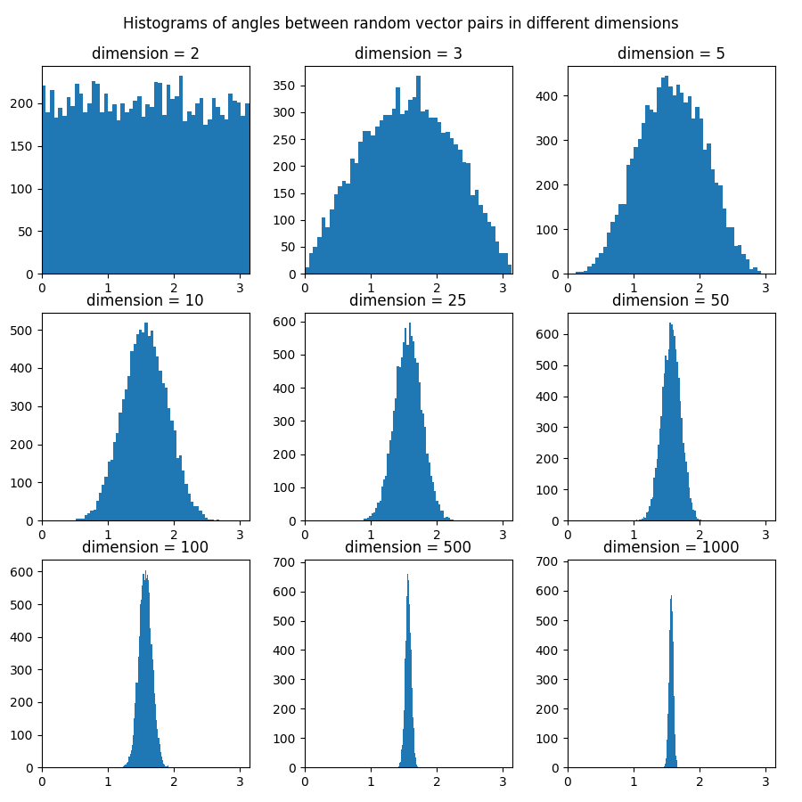
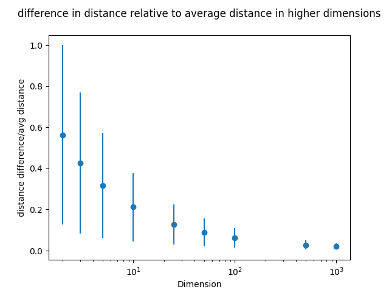

# Curse of dimensionality
Two experiments that show unexpected behavior of higher-dimension spaces

## Experiment 1 - angles between random vectors
We fill a hypercube with points uniformly and then:
  1. select 2 vectors by choosing 4 points from the hypercube
  2. calculate the angle between the vectors

### Results
Results of the experiment. The hypercube was filled with 100000 points and 10000 random vector pairs selected.

#### The distribution of angles in different dimensions

#### 

### Conclusion
In higher-dimensional spaces the angles between random vectors tend to be close to 0.5Pi rad.

## Experiment 2 - distance between random points
We fill a hypercube with points uniformly and then:
  1. choose a random starting point
  3. choose two random points from the hypercube and calculate their euclidean distance to the starting point
  4. check how big the difference between those distances is in comparison to the average distance.

### Results
Results of the experiment. The hypercube was filled with 100000 points and 10000 random point sets selected. 
  

### Conclusion
In higher-dimensional spaces the difference between distances was small in comparison to the average distance.  
The distance between random points tends toward a specific value.
